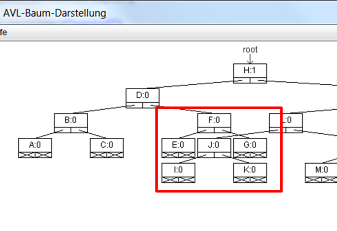
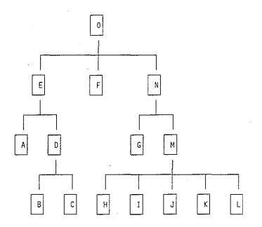
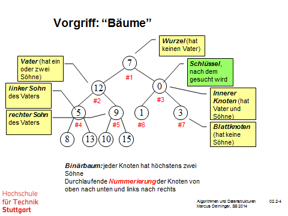
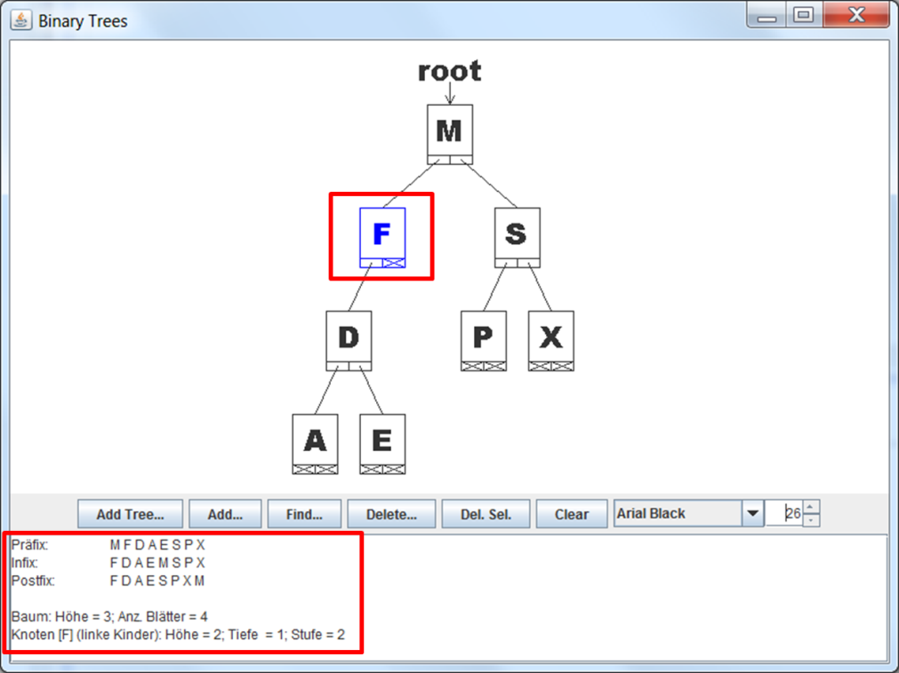
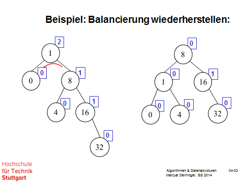
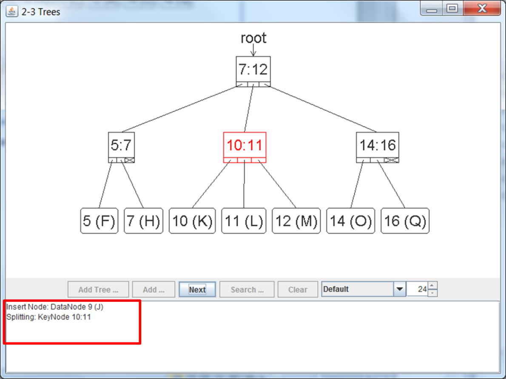

# java-treepanel | Visualisierung von Bäumen und Baumalgorithmen

Im Rahmen der Vorlesung „Algorithmen und Datenstrukturen" werden u.a. Bäume und Algorithmen für Bäume vorgestellt. Bäume wurden von dem englischen Mathematiker Arthur Cayley 1857 (Cayley, 1857) eingeführt. Von Anfang an werden Bäume auch graphisch dargestellt (Cayley, 1859).


Abb. 1: Darstellung von Bäumen (Cayley, 1859)

In der Informatik haben Bäume und Baumalgorithmen eine zentrale Rolle, siehe z.B. (Wirth, 1975), da sie durch ihre besondere Struktur hierarchische Organisationen zulassen, die effizient durchsucht werden können.

In der Vorlesung „Algorithmen und Datenstrukturen" werden die folgenden Varianten vorgestellt:

-   Heaps: Als Grundlage für den Heapsort-Algorithmus und Priority-Queues

-   Binärbäume: Einfache Bäume zur Ablage und Suche von Informationen mit maximal zwei Nachfolgeknoten.

-   AVL-Bäume (Georgi Maximowitsch **A**delson-**V**elski und Jewgeni Michailowitsch **L**andis, siehe: (Adelson-Velsky, et al., 1962)): Binärbäume, die soweit reorganisiert werden, dass sie eine Suche in logarithmischer Zeit garantieren.

-   2-3-Bäume (vorgestellt von John Hopcroft 1970, siehe (Aho, et al., 1983)): Bäume mit zwei bis drei Nachfolgeknoten und mit gleich langen Wegen zu einem Datenknoten von der Wurzel. Die 2-3-Bäume stellen einen Spezialfall der B-Bäume (Bayer, et al., 1972) dar. Die B-Bäume stellen sind ein Grundlage für die Organisation von Daten in der Informatik (z.B. Dateisysteme oder Datenbanken). Sie werden in der Vorlesung nicht weiter ausgeführt, der Transfer vom 2-3-Baum ist aber einfach. (Der Name „B-Baum" ist nicht eindeutig geklärt; er steht evtl. für „balanciert" oder für „Bayer", (Comer, 1979))

Zur Vorstellung in der Vorlesung und für die Übungsaufgaben zur Vorlesung sollen die Bäume visualisiert werden. Während die Visualisierung manuell mit Papier und Bleistift (bei kleinen Bäumen) vergleichsweise einfach gelingt, ist die automatische Darstellung schwierig. (Rusu, 2014) gibt eine Übersicht über mögliche Ansätze. Klassisch wird in der Mathematik eine Ebenen-basierte Darstellung angestrebt, bei der die Knoten einer Ebene alle den gleichen Abstand von
der Wurzel haben und Knoten einer tieferen Ebene unter den Knoten einer höheren Ebene liegen.

Abb. 2 zeigt eine naive Implementierung basierend auf
Binärbaumvisualisierungen von (Aleman-Meza, 2003). Diese Darstellung ist zwar Ebenen-basiert, die Knoten einer Ebene überschneiden sich aber.



Abb. 2: Fehlerhafte Darstellung eines Baums

Inzwischen gibt es offene Java-Implementierungen, die erlauben, Bäume darzustellen. Diese Implementierungen basieren auf dem grundlegenden Algorithmus von (Walker, 1989) und (Walker, 1990), der eine systemunabhängige Berechnung der Positionen erlaubt (Abb. 3).



Abb. 3: Beispielbaum nach dem Algorithmus von (Walker, 1989)

Eine offene Implementierung ist z.B. abego TreeLayout, ( (Abego
Software, 2011), siehe Abb. 4).


Abb. 4: Beispielbaum (Abego Software, 2011)

Während die Positionierung korrekt (und z.T. optimiert ist), verlangt die Nutzung dieser Frameworks größere Anpassungen an die darzustellenden Algorithmen (z.B. Implementierung von Interfaces, Implementierung elementarer Darstellungsformen, usw.). Da in der Vorlesung die Nutzung des Algorithmus soweit wie möglich von der Darstellung entkoppelt sein soll, um den Studierenden die wesentlichen Aspekte des Algorithmus zu
vermitteln, habe ich mich entschlossen eine eigene Implementierung vorzunehmen, die maximal entkoppelt ist.

In den folgenden Abschnitten wird zunächst diese Implementierung beschrieben, im Anschluss wird demonstriert, wie diese Komponenten in der Lehre eingesetzt werden kann.

## Die TreePanel-Komponente

Die Tree-Panel-Komponente liegt als jar-File mit Sourcen, javadoc, JUnit-Test und Demo vor.

### Einführung

Die TreePanel-Komponente ist eine Unterklasse des JPanels und kann damit
wie beliebige andere Swing-Komponenten in eine graphische
Benutzeroberfläche eingebunden werden. Die Komponente benötigt zwei
Parameter:

-   Ein Objekt vom Typ Style. Dieses Objekt enthält die Konfiguration zur Darstellung, wie z.B. Abstand der Ebenen, Abstand von Knoten einer Ebene, Knotengröße, usw. (s.u.)

-   Ein beliebiges Objekt. Dieses Objekt wird als Wurzel einer
    Baumstruktur interpretiert. Das Objekt wird nach rekursiven
    Elementen durchsucht. Die Wurzel mit seinen rekursiven Elementen
    wird gemäß dem Style dargestellt. Das Wurzelobjekt kann ein POJO
    sein und muss keine besonderen Elemente bereitstellen. Zusätzlich
    können rekursive Elemente durch Annotationen explizit bezeichnet
    oder ausgeschlossen werden und Methoden zur Knotenbeschriftung
    bezeichnet werden (s.u.). Der Typ des Wurzelobjekts ist als
    Typparameter vorgesehen -- dies ermöglicht, dass die Wurzel auch
    wieder vom TreePanel per Getter geliefert werden kann.

Listing 1 definiert eine einfache rekursive Datenstruktur: Ein Baum mit
beliebig vielen Kindern. Das zugehörige UML-Diagramm wird in Abb. 5
gezeigt.

```java
import java.util.ArrayList;
import java.util.List;

public class Node {
	
	private String label;
	private List<Node> children = new ArrayList<>();

	public Node(String label, Node ... nodes) {
		this.label = label;
		this.add(nodes);
	}
	
	public void add(Node ... nodes){
		for(Node node : nodes)
			children.add(node);
	}

	@Override
	public String toString() {
		return label;
	}
}
```

Listing 1: Definition einer rekursiven Datenstruktur Node


Abb. : UML-Diagramm für die Klasse Node

Listing 2 definiert ein einfaches Frame, das ein Objekt der Klasse Node
darstellen kann.

```java
import java.awt.Dimension;
import javax.swing.JFrame;

import trees.panel.TreePanel;
import trees.panel.style.Shape;
import trees.panel.style.Style;

public class Displayer extends JFrame{

	public Displayer(Node root){
		super("Sample");

		Style style = new Style(20, 20, 45);
		style.setShape(Shape.ROUNDED_RECTANGLE);
		TreePanel<Node> treePanel = new TreePanel<Node>(style, root);

		this.add(treePanel);
		this.setPreferredSize(new Dimension(325, 200));
		this.setDefaultCloseOperation(JFrame.EXIT_ON_CLOSE);
		this.setLocationByPlatform(true);
		this.pack();
		this.setVisible(true);
	}
}
```

Listing 2: Darstellung eines Baums vom Typ Node

Der Konstruktor **new** Style(20, 20, 45) erzeugt ein neues Style-Objekt
mit 20 Pixeln Abstand zwischen Geschwistern und Nachbarbäumen sowie 45
Pixeln Abstand zwischen zwei Ebenen. Der Setter
style.setShape(Shape.*ROUNDED_RECTANGLE*) legt als Darstellung Rechtecke
mit runden Ecken fest. Der Konstruktor **new** TreePanel\<Node>(style,
root) erzeugt ein neues TreePanel mit dem festgelegten Style und dem
root-Objekt.

Listing 3 zeigt schließlich die main-Klasse, die ein Baum-Objekt
aufbaut und an die Darstellungsklasse übergibt.

```java
public class Main {
	
	public static void main(String[] args) {
				
		Node root = new Node("root", 
				new Node("n1",
						new Node("n1.1\n(first node)"),
						new Node("n1.2"),
						new Node("n1.3\n(last node)")), 
				new Node("n2", 
						new Node("n2.1")),
				new Node("n3"));
		
		new Displayer(root);
	}
}
```

Listing 3: Erzeugung eins Baums und Aufruf der Darstellung

Abb. 6 zeigt die erzeugt Darstellung (siehe auch Abb. 44 zum Vergleich)


Abb. 6: Visualisierung des Baums aus Listing 1-3

### Detaillierte Beschreibung

Abb. 7 zeigt das Paketdiagramm der TreePanel-Komponente mit allen
Paketen und Klassen


Abb. 7: Paketdiagramm der TreePanel-Komponente mit allen Paketen und
Klassen. (Die Pakete, die Schnittstellen für die Anwendung enthalten,
sind grau hinterlegt.)

Für die Nutzung von der TreePanel-Komponent sind die folgenden Klassen
notwendig:

-   package trees.panel

	-   TreePanel: Unterklasse von JPanel, die eigentliche
    Darstellungskomponente

	-   FontPanel: Hilfsklasse zur einfachen Erzeugung eines Font-Dialogs.

	-   package trees.style

	-   Style: zentrale Klasse zur Konfiguration der Darstellung; die
    folgenden (einfachen) Klassen definieren die möglichen Werte

	-   Shape: Aufzählungstyp; RECTANGLE oder ROUNDED_RECTANGLE

	-   Orientation: Aufzählungstyp; NORTH (Wurzel oben, Baum wächst nach
    unten); SOUTH (Wurzel unten, Baum wächst nach oben), EAST (Wurzel
    rechts, Baum wächst nach links); WEST (Wurzel links, Baum wächst
    nach rechts)

	-   Alignment: Aufzählungstyp; LEFT (Baum ist am linken Rand); RIGHT
    (Baum ist an rechten Rand), TOP (Baum ist an oberen Rand), BOTTOM
    (Baum ist an unteren Rand), TREE_CENTER (Baum ist im Panel
    zentriert), ROOT_CENTER (Wurzel ist im Panel zentriert)

	-   Size: abstrakte Klasse zur Definition von fixen oder variablen
    Größen; Unterklassen für konkrete Ausprägungen. Die Unterklassen
    müssen nicht direkt verwendet werden; stattdessen können
    entsprechende statische Factory-Methoden von Size verwendet werden.

-   package trees.annotations

	-   Nodes: Feld-Annotation, die explizit rekursive Felder kennzeichnet
    -- falls die Annotation fehlt, werden alle rekursiven Felder
    verwendet.

	-   Ignore: Feld-Annotation, die explizit rekursive Felder ausschließt
    -- falls die Annotation fehlt, werden alle rekursiven Felder
    verwendet.

	-   Label: Methoden-Annotation, die explizit Methoden kennzeichnet, die
    Knotenbeschriftungen liefern -- falls die Annotation fehlt, wird die
    toString-Methode verwendet.

-   package trees.synchronization (_in späteren Version gelöscht, da zu kompliziert_)
	-   Interruptable: Abstrakte Klasse, die die Fähigkeit einbringt,
    Breakpoints im Code zu setzen. Eine Klasse muss dazu lediglich diese
    Klasse als Oberklasse definieren und die zwei Methoden getSenders()
    und getReceivers() definieren. Die Methode getSenders() soll dabei
    eine Liste von Sendern liefern, die einen Observer über eine
    Änderung der Baumstruktur informieren können. Die Methode
    getReceivers() liefert eine Liste von Empfängern, die fortgesetzt
    werden können.

	-   Synchronizable: Abstrakte Klasse, die die Fähigkeit einbringt, Code
    asynchron auszuführen. Eine Klasse muss dazu lediglich diese Klasse
    als Oberklasse definieren und die Methode getReceivers() definieren.

	-   Die (komplexe) Nutzung dieser Klassen ist notwendig, wenn ein
    bestehender Baumalgorithmus schrittweise ausgeführt (d.h. immer
    wieder pausiert) werden soll, ohne dass der Algorithmus dabei massiv
    verändert werden soll. In diesen Fällen kann an bestimmten Stellen
    die Methode this.breakpoint(String message, Object source)
    aufgerufen werden. Diese Methode unterbricht die Aktion und wartet
    auf ein Resume der grafischen Benutzeroberfläche. Die
    Implementierung des 2-3-Baums verwendet diesen Mechanismus.

Alle übrigen Klassen dienen lediglich zur internen Unterstützung. Der
Algorithmus von Walker 1989 ist in der Klasse
trees.layout.LayoutAlgorithm implementiert. Die Implementierung folgt im
Wesentlichen der Darstellung in Walker 1989, dabei wurden
offensichtliche Fehler korrigiert. Einzige wesentliche Abweichungen
waren:

-   Umbenennung der Methoden firstWalk und secondWalk in
    preliminaryPositioning und finalPositioning

-   (Java-bedingte) unterschiedliche Initialisierung der Koordinaten für
    die Orientierung.

-   Berechnung der Teilbaumgrößen mit Hilfe der Knotengrößen statt der
    Verwendung der „meanNodeSize", die zu unbefriedigenden Ergebnissen
    führte.


## Test und Demo

Listing 4 zeigt einen Junit-Test für die
TreePanel-Komponente. Der Test baut den Beispielbaum aus Walker, 1989
(s. Abb. 3) auf. Dabei wurden die Größen mit 10 multipliziert, um dem
Java-Koordinatensystem Rechnung zu tragen.

```java
import trees.layout.LayoutAlgorithm;
import trees.layout.ModelData;
import trees.layout.Node;
import trees.style.Style;
import static trees.style.Size.*;

public class TestLayoutAlgorithm {
	private Node a, b, c, d, e, f, g, h, i, j, k, l, m, n, o, root;
	private LayoutAlgorithm algorithm;
	private Style style;
	
	private static class Stub {
		private String label;

		public Stub(String label) {
			this.label = label;
		}

		@Override public String toString() {
			return label;
		}
	}
	
	private Node newNode(String label){
		Stub stub = new Stub(label);
		ModelData model = ModelData.newElement(stub, Stub.class, label, style);
		Node node = new Node(model, style);
		return node;
	}
	
	@Before public void setUp(){
		style = new Style(40, 40, 40, FIXED(20, 20));
		algorithm = new LayoutAlgorithm();
		a = newNode("A"); b = newNode("B"); c = newNode("C");
		d = newNode("D"); e = newNode("E"); f = newNode("F");
		g = newNode("G"); h = newNode("H"); i = newNode("I");
		j = newNode("J"); k = newNode("K"); l = newNode("L");
		m = newNode("M"); n = newNode("N"); o = newNode("O");
		o.add(e, f, n);
		e.add(a, d);
		d.add(b, c);
		n.add(g, m);
		m.add(h, i, j, k, l);
		root = o;
	}
	
	@Test
	public void test1(){
		
		algorithm.positionTree(style, root);
		root.printPostOrder();
				
		assertEquals(0, a.getPrelim()); assertEquals(0, a.getModifier());
		assertEquals(0, a.getX());
		assertEquals(0, b.getPrelim()); assertEquals(0, b.getModifier());
		assertEquals(30, b.getX());
		assertEquals(60, c.getPrelim()); assertEquals(0, c.getModifier());
		assertEquals(90, c.getX());
		assertEquals(60, d.getPrelim()); assertEquals(30, d.getModifier());
		assertEquals(60, d.getX());
		assertEquals(30, e.getPrelim()); assertEquals(0, e.getModifier());
		assertEquals(30, e.getX());
		assertEquals(135, f.getPrelim()); assertEquals(45, f.getModifier());
		assertEquals(135, f.getX());
		assertEquals(0, g.getPrelim()); assertEquals(0, g.getModifier());
		assertEquals(210, g.getX());
		assertEquals(0, h.getPrelim()); assertEquals(0, h.getModifier());
		assertEquals(150, h.getX());
		assertEquals(60, i.getPrelim()); assertEquals(0, i.getModifier());
		assertEquals(210, i.getX());
		assertEquals(120, j.getPrelim()); assertEquals(0, j.getModifier());
		assertEquals(270, j.getX());
		assertEquals(180, k.getPrelim()); assertEquals(0, k.getModifier());
		assertEquals(330, k.getX());
		assertEquals(240, l.getPrelim()); assertEquals(0, l.getModifier());
		assertEquals(390, l.getX());
		assertEquals(60, m.getPrelim()); assertEquals(-60, m.getModifier());
		assertEquals(270, m.getX());
		assertEquals(240, n.getPrelim()); assertEquals(210, n.getModifier());
		assertEquals(240, n.getX());
		assertEquals(135, o.getPrelim()); assertEquals(0, o.getModifier());
		assertEquals(135, o.getX());
	}
}
	
```


Listing 4 JUnit Test für TreePanel


## Einsatz der TreePanel-Komponente in der Lehre

### Heapsort

Abb. 8 zeigt die Vorlesungsfolie zu Heapsort, Abb. 9 die zugehörige
Java-Visualisierung, die es erlaubt, schrittweise den Sortiervorgang zu
beobachten.



Abb. 8: Vorlesungsfolie zum Heapsort


Abb. 9: Darstellung von Heapsort mit TreePanel

### Binärbäume

Abb. 10 zeigt die Vorlesungsfolie zu den Baumeigenschaften. Auf Basis
dieser Definition erhalten die Studierenden einen Coderahmen für einen
Binärbaum. Der Coderahmen erlaubt, Knoten anzulegen, zu selektieren und
zu löschen. Offen sind die Codeteile, die die Baumeigenschaften
bestimmen. Diese Teile sollen im Rahmen der Übung vervollständigt
werden. Mit Hilfe des Testprogramms aus Abb. 11 kann die Lösung
überprüft werden.


Abb. 10: Vorlesungsfolie zu Baumeigenschaften



Abb. 11: (Fertiges) Übungsprogramm zu Baumeigenschaften

### AVL-Bäume

Abb. 12 zeigt eine Vorlesungsfolie zu AVL-Bäumen, die die
Reorganisationsalgorithmen beschreibt. Auf Basis dieser Definition
erhalten die Studierenden einen Coderahmen für AVL-Bäume. Der Coderahmen
erlaubt, Knoten anzulegen. Offen sind die eigentlichen
Reorganisationsschritte. Diese Teile sollen im Rahmen der Übung
vervollständigt werden. Mit Hilfe des Testprogramms aus Abb. 33 kann die
Lösung überprüft werden. Insbesondere besteht die Möglichkeit, die
Teilschritte des Algorithmus auszuführen, um so die Arbeitsweise des
Algorithmus nachzuvollziehen.



Abb. 12: Vorlesungsfolie zu AVL-Bäumen


Abb. 13: (Fertiges) Übungsprogramm zu AVL-Bäumen

### 2-3-Bäume

Abb. 14 zeigt eine Vorlesungsfolie zu 2-3-Bäumen, die die
Reorganisationsalgorithmen beschreibt. Abb. 15 und Abb. 16 zeigen eine
Implementierung dieser Algorithmen, die es erlaubt die Teilschritte des
Algorithmus auszuführen, um so dessen Arbeitsweise nachzuvollziehen.


Abb. 14: Vorlesungsfolie zu 2-3-Bäumen



Abb. 15: Darstellung von 2-3-Bäumen mit TreePanel


Abb. 16: Darstellung von 2-3-Bäumen mit TreePanel

# Literatur

**Abego Software. 2011.** treelayout. Efficiently create compact tree
layouts in Java. \[Online\] 2011. https://code.google.com/p/treelayout/
zuletzt am 15.2.2015.

**Adelson-Velsky, Georgi Maximowitsch und Landis, Jewgeni
Michailowitsch. 1962.** An Algorithm for the Organization of Information
(Aus dem Russischen übersetzt von Myron J. Ricci). *Soviet Mathematics
3.* 1962, S. 1259-1263.

**Aho, Alfred V., Hopcroft, John E. und Ullman, Jeffrey. 1983.** *Data
Structures and Algorithms.* Boston : Addison-Wesley, 1983.

**Bayer, Rudolf und McCreight, Edward M. 1972.** Organization and
Maintenance of Large Ordered Indexes. *Acta Informatica.* 1972, Bd. 1,
S. 173--189.

**Cayley, Arthur. 1857.** On the Theory of Analytical Forms called
Trees. *Philosophical Magazine.* 1857, Bd. 13, S. 172-176 (Reprint in:
The Collected Mathematical Papers of Arthur Cayley. Band 3, Cambridge
University Press, Cambridge, 1890, S. 242-246; digitalisiert beim
Internet Archive: www.archive.org/details/collmathpapers03caylrich).

**---. 1859.** On the Theory of Analytical Forms called Trees. Second
Part. *Philosophical Magazine.* 1859, Bd. 17, S. 374-378 (Reprint in:
The Collected Mathematical Papers of Arthur Cayley. Band 4, Cambridge
University Press, Cambridge, 1891, Seite 112-115; digitalisiert beim
Internet Archive: www.archive.org/details/collmathpapers02caylrich).

**Comer, Douglas. 1979.** The Ubiquitous B-Tree. *Computing Surveys.*
Juni 1979, Bd. 11, 2, S. 123--137.

**Rusu, Adrian. 2014.** Tree Drawing Algorithms. \[Buchverf.\] Roberto
Tamassia. *Handbook of Graph Drawing and Visualization.* Boca Raton :
CRC Press, 2014, S. 155-192.

**Walker, John Q. II. 1990.** A Node-Positioning Algorithm for General
Trees. *Software-Practice and Experience.* 1990, Bd. 20, 7, S. 685--705.

**---. 1989.** *A Node-Positioning Algorithm for General Trees
(TR89-034).* Department of Computer Science, The University of North
Carolina at Chapel Hill. 1989.

**Wirth, Niklaus. 1975.** *Algorithmen und Datenstrukturen.* Stuttgart :
Täubner Verlag, 1975.
